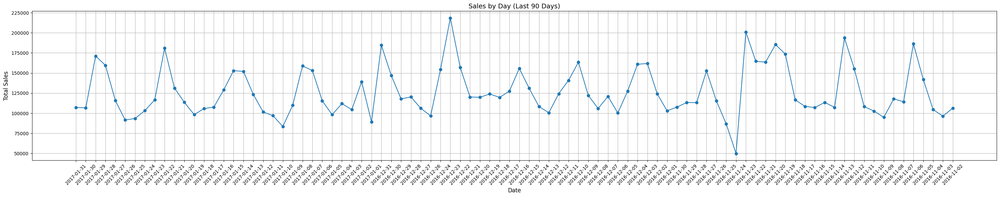
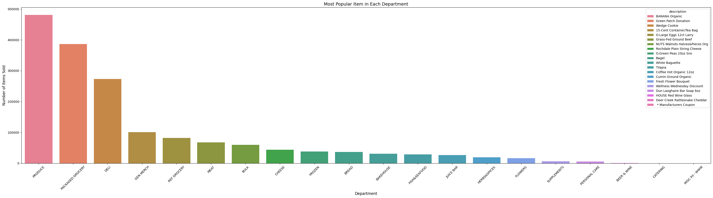
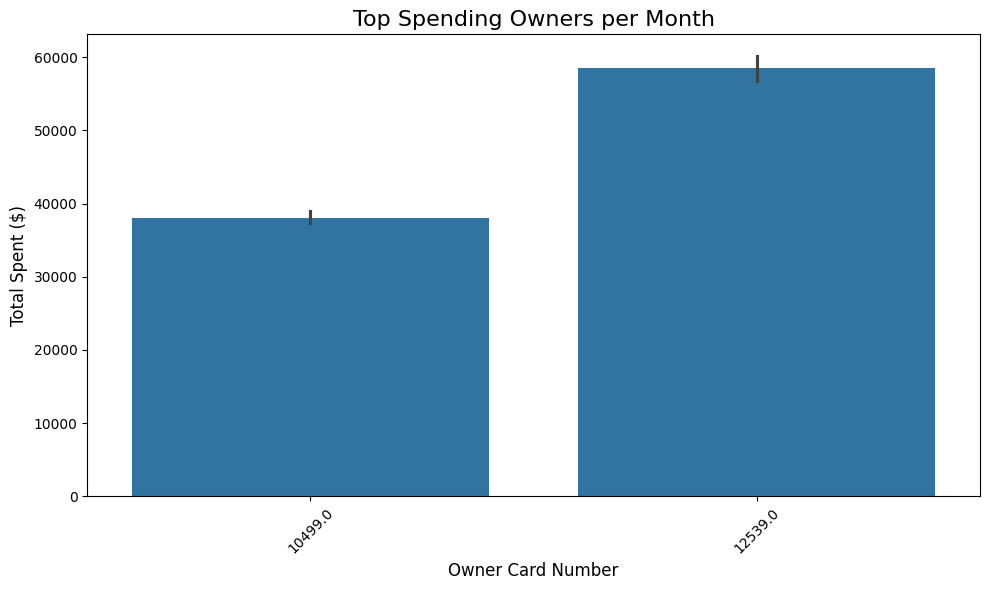
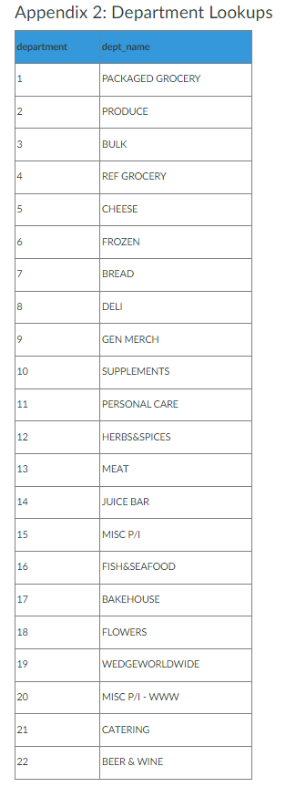

# Wedge Project

In this project we will explore the world of data engineering with a deep dive into using data pipelines to understand how raw data is transformed into consumable data. This project will also explore defining the datasets we need for work and the skills required in order to do this effectively. 

## Background of Wedge Co-Op 

The Wedge Co-Op is the largest co-operative grocery store in the US and is in Minneapolis, MN. Through a partnership with the co-op, we have data dating back to January 1, 2010, from the point-of-sale (POS) system that the Wedge developed. We have data through January 2017. This system logs every row of every receipt. While we do not have other sources of data such as ordering, inventory, and spoilage, this transaction-level view is one of the richest data sets available to us. The source of this richness is that the Wedge is a member-owned co-operative. The public is welcome to shop there, but membership is lightweight: $80 (which can be paid in installments) buys you shares which entitles you to $3.75 off per month, other Member discounts, and annual refunds based on business profitability.

About 75% of transactions are generated by owners. For those owners, we have a full record of their shopping at the co-op and can understand the changes to their consumption over time and can add dimensions like products and departments shopped.

On the other hand, having raw POS records comes with its own challenges. For instance, the transaction records contain many records that are not item purchases like payment, tax, discounts, members rounding up for charity and change. So, the data is valuable, but we’re going to have to do some work.

The zip of files is quite large, around 2.6 GB. Unzipped the data is approximately 15 GB.

Interestingly, the Wedge has given this away to other grocery stores across North America. One of our long-term program goals is to extend our co-op footprint to more partners. In 2016 we added the Missoula Community Food Co-op. Then they went out of business in 2017. ☹

Owners are typically individuals, households, or buying clubs.

## Data Background

The data is stored in delimited text files - some are delimited with commas, some delimited with semicolons. Blank fields are typically given the value of "NULL" but the Wedge also uses "\N" or "\\N". The files cover one or three months. In early 2015 Wedge was splitting out inactive owner transactions, but then in 2015 switched to keep those records in the same file. 

## Task Breakdown

### Task 1: Building a Transaction Database in Google Big Query

There will be three tasks to complete for this project. The first task will require that all Wedge transaction records are uploaded to Google Big Query. For this task it is essential that the column data types are correctly specified and all null values are properly handled. 

### Task 2: A Sample of Owners

In the second task a file of owners will be generated where the file contains every record for each owner. There will be more than one owner in the file and we are not going to include card_no==3, which is the code for non-owners. The size of the sample that will be aimed for is around 250 MB. For this task, there will be a python script that is produced in order to: 
    1. Connect GBQ Instance
    2. Builds a List of Owners
    3. Takes a sample of the owners
    4. Extracts all records associated with the owners and writes them to a local text file. 

### Task 3: Building Summary Tables

How sales-by-day changed over the last few months? What the most popular item in each department is? Which owners spend the most per month in each department? These among others, are significant questions that likely influencing business decisions. Therefore it is important to build a relational database with data that can be used to answer those questions. 

For this task, owner records were processed in Google Big Query in order to build summary tables that output the following along with a submitted python code:
Output: A single SQLite database via Python (in a .db file) containing three tables:
    1. Sales by date by hour: By calendar date (YYYY-MM-DD) and hour of the day, determine the total spend in the store, the number of transactions, and a count of the number of items.
    2. Sales by owner by year by month: A file that has the following columns: card_no, year, month, sales, transactions, and items.
    3. Sales by product description by year by month: A file that has the following columns: upc, description, department number, department name, year, month, sales, transactions, and items.

Working through this task, and then validating the database afterwards truly provided me with feelings of creating something truly useful, and it was really awesome. 

####################################################################################

## Appendix 1: Wedge Transaction Data Columns
1. datetime: timestamp of the transaction-row creation
2. register_no: register for transaction
3. emp_no: employee number for cashier
4. trans_no: transaction number. This number counts up by day and is only unique when combined with date, register and employee.
5. Upc: Universal Product Code for the item. 0 for non-items.
6. description: product description. Includes things like Tax, Tender type, etc.
7. trans_type: One of five values (D, G, A, T, and I). These correspond to the following types of transactions:
    D: Departmental rings, when the cashier just selects a department for the item.
    G: Green patch donations. This is the donation made for shoppers who bring their own bag.
    A: Tax
    T: Tender, the payment row.
    I: Items, but also includes discounts.
8. trans_subtype: There are a lot of these. Key ones include methods of payment (CK for Check, CA for Cash, CP for coupon, EF for EBT Food Stamps[1], WC for WIC). These are often blank for other trans_type values.
9. trans_status: An important field. The field trans_status tells us more about the types transactions. Here are the possible values:
    Blank: The typical value.
    M: Member discounts.
    V: Voids
    C: Coupons
    0: Honestly, I think these are supposed to be blanks but they changed from 0s at some point in February 2010.
    R: Returns.
    J: Juice club cards
10. department: The number of the department. See the next appendix for a department lookup table.
11. quantity: The purchased quantity. Beware, some items such as flowers and bulk vegetables are priced per cent and then sold in very large quantities (like 1000 for a $10 bouquet.)
12. Scale: The reading on the scale. Note that the capital here is not a typo. This is one field that weirdly has a capital first letter.
13. cost: the per-unit cost of an item to the Wedge. This is not uniformly populated.
14. unitPrice: the per-unit cost of an item to an owner. Negative for things like returns and discounts.
15. total: price times quantity. The cost of the line item. Note that this can be negative because unitPrice can be negative.
16. regPrice: The regular price of an item. May be different from unitPrice but unitPrice plus discount should be regPrice.
17. altPrice
18. tax: an indicator of whether or not the item is taxable.
19. taxexempt: mostly zero.
20. foodstamp: can the item be purchased with food stamps?
21. wicable: can the item be purchased with WIC?
22. discount: a marker of any discounts.
23. memDiscount: the member discounts on items.
24. discountable: beats me.
25. discounttype: there’s probably information in here, but I haven’t decoded it.
26. voided: I think it’s used if an item is a void or if an item was run up and subsequently voided.
27. percentDiscount: I don’t use it.
28. ItemQtty: I’m not sure what this is.
29. volDiscType: Ditto
30. volume: Ditto
31. VolSpecial: Ditto
32. mixMatch: Ditto
33. matched: Ditto
34. memType: Mostly NULL or 1, but I’m not sure what it signifies. Maybe institutional memberships?
35. staff: indicative of staff transactions perhaps?
36. numflag: A complicated bitflag that encodes a bunch of other information. I’ll add the communication on this topic to an appendix below, but it’s not critical for our purposes.
37. Itemstatus: Don’t know
38. tenderstatus: Ditto
39. charflag: Ditto
40. varflag: Ditto
41. batchHeaderID: Ditto
42. local: is the item local?
43. organic: is the item organic?
44. display: Don’t know.
45. receipt: Ditto
46. card_no: This one is important. This is the masked owner number for the transaction. It is an integer. If the value is 3, then the transaction is for a non-owner. You’ll find some owners (like 11572) that have a huge number of transactions. These are likely other co-ops. If you are a member of, say, the Seward Co-op you can receive discounts at the Wedge. The cashier selects your co-op and the receipt is flagged as being from that co-op.
47. store: 1 for the main store and 512 for catering.
48. branch: 0 for the main store and 3 for the Wedge Table, a grab-and-go bodega they opened in January 2015.
49. match_id: don’t know
50. trans_id: a counter that increments the line items of a receipt.

##################

## Appendix 2: Department Lookups

